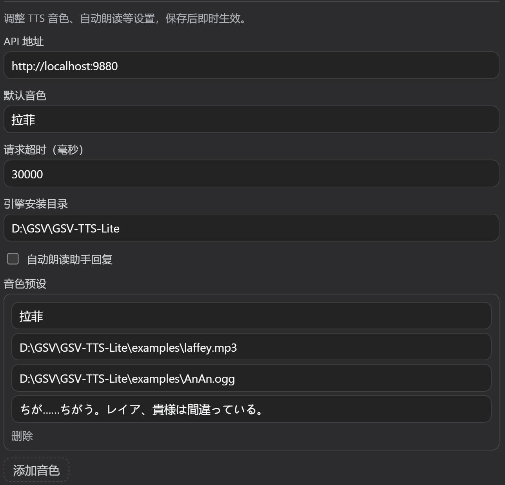
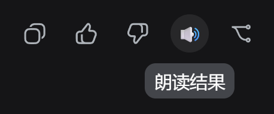
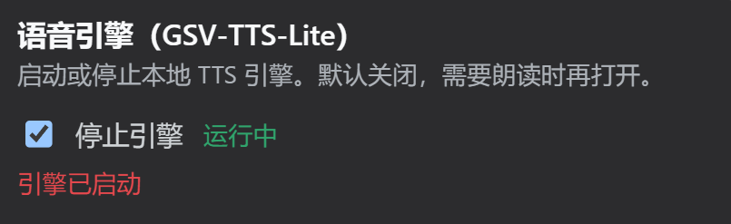

# dsh-gsv-tts


A DSH (DeepSeek Harness) plugin that integrates the [GSV-TTS-Lite](https://github.com/chinokikiss/GSV-TTS-Lite) local TTS engine: voice cloning, streaming synthesis, auto-read, one-click read-aloud, and one-click engine control.

中文 README: [README.md](README.md)

## Features

- **Voice Settings panel**: Settings → Voice Settings — configure the engine, voices, auto-read, etc., with **hot-applied changes** (no restart needed)
- **Engine switch**: start/stop the local GSV-TTS-Lite engine with one toggle (off by default)
- **Read-aloud button**: a 🔊 button next to copy/like on every assistant message reads that result aloud (thinking/reasoning excluded); when the engine is off it explains why
- **Auto-read**: automatically synthesize assistant replies when enabled
- **TTS tools**: `tts_speak` (streaming, returns a same-origin short link), `tts_list_voices`, `tts_health_check`, `tts_setup_engine`
- **Audio delivery**: synthesized audio is saved as WAV and served through the DSH web server as a same-origin short link (no more giant data URLs in model context)

## Installation

Choose one of the two methods, then enable it in Settings:

### Option 1: Install from npm

```bash
dsh plugin --profile web add dsh-gsv-tts
```

### Option 2: Install from GitHub

```bash
dsh plugin --profile web add "github:TaoruiLiu19/dsh-gsv"
```

> **About profiles**: the commands above use the `web` profile as an example. Desktop users typically use the `desktop` profile — just replace `web` with `desktop`.

After installing, restart DSH. The tools register automatically and a "Voice Settings" item appears in Settings.

> Requires the DSH `webServer` service (bundled with the Web/Desktop profiles) for audio delivery and the `settings` service for the settings panel. Environments without these services keep only the tool capabilities.

## Quick Start

1. **Install the engine**: ask the agent to call `tts_setup_engine` (or install manually below)
2. **Start the engine**: Settings → Voice Settings → toggle "Start engine" on and wait until it shows "Running" (model loading takes ~15–90 s)
3. **Add a voice**: Settings → Voice Settings → "Voice presets" → Add voice → fill in the four fields → Save
4. **Read aloud**: click the 🔊 button next to any assistant message, or ask the agent to call `tts_speak`

## Screenshots



*Settings → Voice Settings: engine switch, TTS configuration, help*



*The 🔊 read-aloud button in the message action row (tooltip "Read result")*



*The "Running" state after the engine starts*

## Installing the GSV-TTS-Lite Engine

### Option 1: Automatic (recommended)

Ask the agent to call `tts_setup_engine`. It automatically: detects Python → installs `gsv-tts-lite==0.4.7` → clones the repo → installs dependencies → deploys the streaming API → starts the service.

### Option 2: Manual

1. Install **Python 3.10+** (3.12 recommended) with `pip` available
2. Install the core package: `pip install gsv-tts-lite==0.4.7`
3. Clone the repo: `git clone https://github.com/chinokikiss/GSV-TTS-Lite.git`
4. Install API dependencies: `pip install -r <repo>/API/requirements.txt`
5. Copy `dsh_stream_api.py` from this plugin's `scripts/` folder into `<repo>/API/` (true streaming API)
6. Download the models (`s1v3.ckpt`, `s2Gv2ProPlus.pth`, ...) into `<repo>/models/`
7. Start: `python <repo>/API/dsh_stream_api.py -p 9880 --models_dir <repo>/models`
8. In Settings → Voice Settings, toggle the engine on to verify

> Example audio lives in `<repo>/examples/` (`laffey.mp3`, `AnAn.ogg`) — usable as test voices.

## Adding a Voice

1. Open Settings → Voice Settings
2. Under "Voice presets", click "Add voice"
3. Fill in the four fields:

| Field | Description | Example |
|-------|-------------|---------|
| `Voice name` | Voice identifier used by `tts_speak` and the 🔊 button | `Laffey` |
| `Speaker audio path` | Reference audio of the target voice (defines who it sounds like) | `D:\GSV\GSV-TTS-Lite\examples\laffey.mp3` |
| `Prompt audio path` | Intonation/emotion reference audio | `D:\GSV\GSV-TTS-Lite\examples\AnAn.ogg` |
| `Prompt text` | The text of the prompt audio (required — the engine has no ASR fallback) | `ちが……ちがう。レイア、貴様は間違っている。` |

4. Click "Save" — changes apply instantly, no restart
5. Leave the default voice empty to use the first voice in the list

> Reference audio paths must be **local paths accessible from the engine host or reachable URLs**.

## Voice Settings Reference

| Field | Description | Default |
|-------|-------------|---------|
| Engine switch | Start/stop the GSV-TTS-Lite engine process | Off |
| `apiUrl` | Engine API URL | `http://localhost:9880` |
| `defaultVoice` | Default voice (empty = first voice) | empty |
| `timeout` | Request timeout (ms) | `30000` |
| `installDir` | Engine install directory | `./GSV-TTS-Lite` |
| `autoPlay` | Auto-read assistant replies | `false` |
| `voices` | Voice preset list | empty |

Config is stored in DSH settings (the `dsh-gsv-tts:` section of `~/.dsh/settings.yaml`) and hot-applied on change.

## Tools

| Tool | Purpose |
|------|---------|
| `tts_speak` | Text-to-speech with voice selection; streaming; returns a same-origin short link |
| `tts_list_voices` | List configured voice presets |
| `tts_health_check` | Check engine/API/Python/repo status |
| `tts_setup_engine` | One-click GSV-TTS-Lite engine installation |

## FAQ

- **Engine not running**: Settings → Voice Settings → toggle on (model loading takes ~15–90 s)
- **Models missing**: the first start will warn; put the models into the `models` directory
- **The read button says "engine not started"**: start the engine in Voice Settings first
- **Reference audio unavailable**: use a local path accessible from the engine host or a reachable URL

## Tech Stack

- DSH plugin framework: Cordis + `@deepseek-ai/dsh-tools`
- Config schema: `@deepseek-ai/schemastery`
- Settings panel: `@deepseek-ai/dsh-settings` + client `settings.section` slots
- TTS engine: GSV-TTS-Lite 0.4.7
- Languages: TypeScript (host) / hand-written client bundle (browser) / Python (streaming API)

## Build & Publish

```bash
pnpm install
pnpm build        # compile host code (lib/)
pnpm publish      # publish to npm (files: lib, scripts, cordis.patch.yml)
```

Installing from GitHub runs the `prepare` script automatically; `lib/client.js` is a hand-written client bundle shipped with the repo.

## Changelog

- **2.3.1**: Completed npm publish metadata (`keywords`, `license`, `repository`, ...) for plugin-marketplace discovery; added GitHub Actions CI and a pre-publish manifest check; added `docs/PUBLISHING.md`
- **2.3.0**: True-streaming client improvements and engine compatibility patch; added engine-install and voice-download guide; added UI screenshots; bilingual README rewrite with clear npm/GitHub install paths
- **2.2.0**: Voice Settings panel (hot-applied); one-click engine switch; 🔊 read-aloud button (excludes reasoning; clear error when the engine is off); in-settings help; same-origin audio short links
- **2.1.0**: same-origin audio via the DSH web server (no more giant data URLs); WAV header/duration fixes; `prompt_text` ASR fallback; `execFileSync` (no shell injection); `py -3` support; health-check path probing

## Known Limitations

- Playback is a clickable markdown link; inline `<audio>` playback needs a client extension (planned)
- Generated audio lives in the system temp dir (`%TEMP%/dsh-gsv-tts`), purged on startup, capped at 200 files per session
- `tts_setup_engine` shells out to pip/git; those tools must be available
- Empty `promptText` relies on the engine's ASR capability (capability-probed); synthesis fails with a clear error when unsupported
